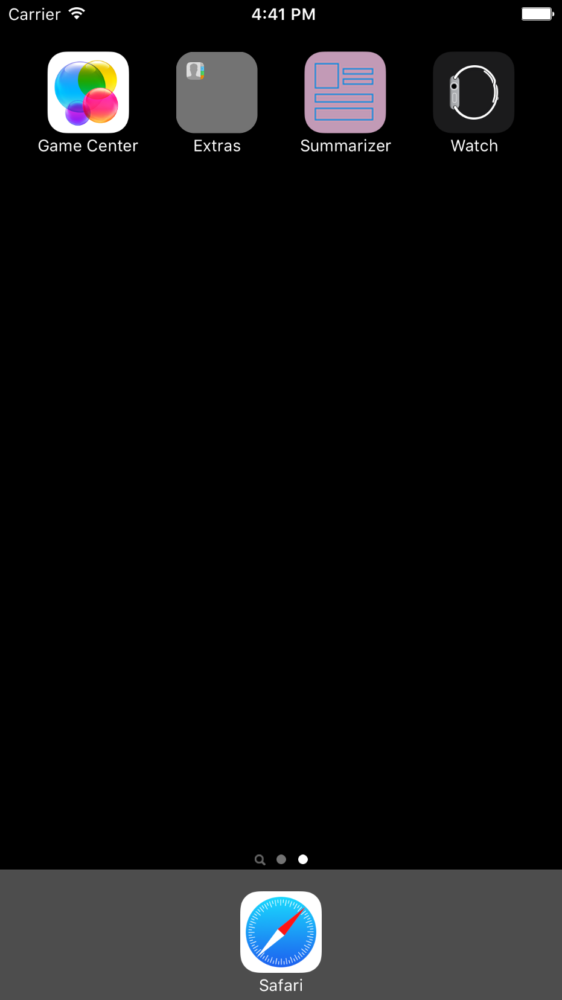
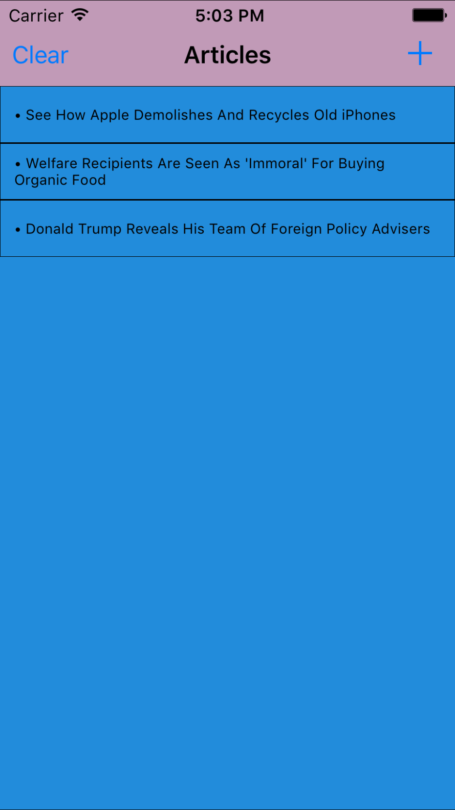
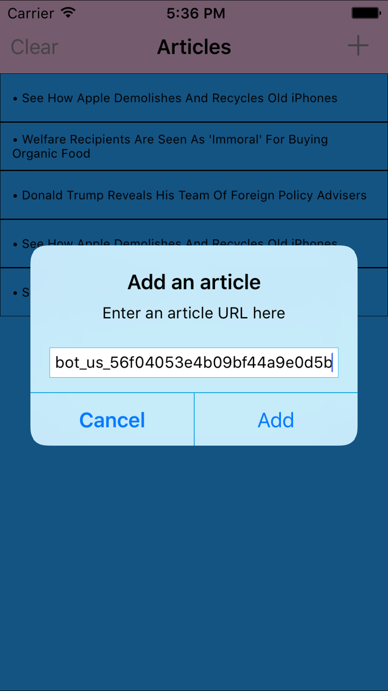
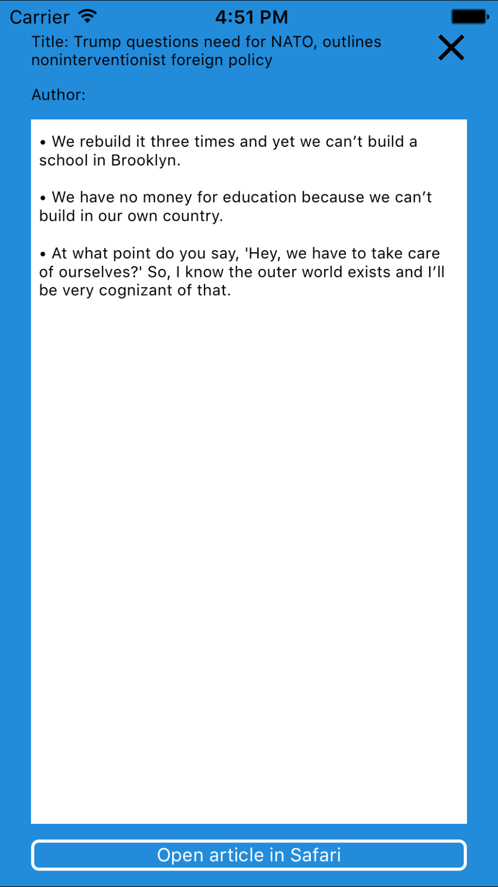
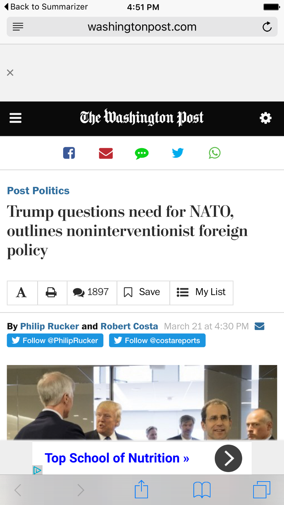

# The Capital One Summit Challenge
A demo iOS app created for the Capital One Summit challenge.  https://www.mindsumo.com/contests/565

This app allows users to compile a list of articles in a single screen, using the Clipped API (www.programmableweb.com/api/clipped) to summarize articles (by retrieving the title and a brief summary of the page's content).  The app is by no means complete; it has some bugs in it.  Moreover, if you put in a site it can't process, it just won't do anything.

To set up this app, simply open the project in Xcode and hit Cmd+R (make sure the simulator is selected).  The app will compile (with some warnings) and open in the simulator.  You can then test the app as you like!

### Testing
Verified links that work include: 
- http://www.huffingtonpost.com/entry/iphone-recycling-robot_us_56f04053e4b09bf44a9e0d5b
- http://www.huffingtonpost.com/entry/people-think-welfare-recipients-are-immoral-for-buying-organic_us_56e6c5fbe4b065e2e3d66d1f
- http://www.huffingtonpost.com/entry/donald-trump-foreign-policy_us_56f02fd3e4b09bf44a9df5c8

Be careful; the NYT and Washington Post both begin blocking requests once you have made too many.  Their sites should work as well, but I am no longer able to test this.

### Skills
- Alamofire (networking requests library)
- SwiftyJSON (JSON manipulation library)
- NSUserDefaults (storage for small amounts of simple, persistent data)
- iOS asset catalogs
- MVC
- Protocols, delegates and extensions
- Asynchronous handlers
- iOS threading (Grand Central Dispatch)

### Screenshots

