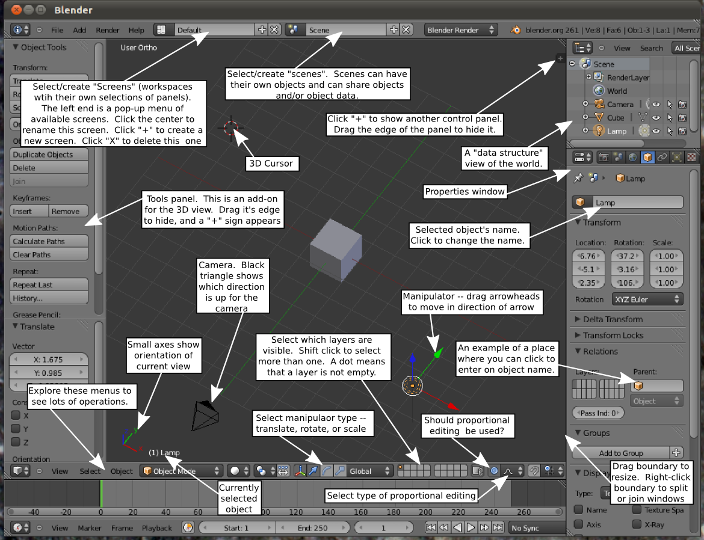
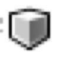
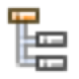
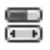
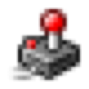

# Building Interactive Applications With Blender
You can checkout more information in the [official manual](https://www.blender.org/manual/contents.html), especially the  but this guide is designed to highlight my best tips for getting started building interactive applications with blender quickly. It focuses on doing things with python scripts as much as possible.

You can start blender on any operating system with an app icon, but you'll find it easier if you can read the raw logs out from the program. On OSX and Linux systems you can make this easy by adding some aliases like below to your `~/.bashrc` file (that sets environment variables for your bash terminal).

### Linux / OSX
This is an example for OSX:

```
# make an python installer for blender
export BLENDER_SYSTEM_PYTHON=~/.virtualenvs/py3/bin/python
export BLENDER_SYSTEM_SCRIPTS=~/blenderscripts
export BLENDER_USER_SCRIPTS=$BLENDER_SYSTEM_SCRIPTS
export BLENDERPATH="~/apps/blender-2.77-OSX_10.6-x86_64/blender.app/Contents"
alias blender="$BLENDERPATH/MacOS/blender"
alias blenderpy="$BLENDERPATH/MacOS/blender --python-console"
alias blenderpip='pip3.5 install --install-option="--prefix=$BLENDERPATH/Resources/2.77/python"'

```
### Windows
On windows, hit `WinKey + R`, type `cmd` to start the command window and run something like below to navigate to the executable path and run the program.

```
cd c:\Program Files\Blender Foundation\Blender\
blender.exe
```

# Interface
The blender interface is composed of modules. You can put any of them *anywhere* you like. You can even optimize like [Pablo Vazquez](http://pablovazquez.org/amaranth) by writing your own custom scripts, attach them to shortcuts, and make it easy for others to install as an addon. This will eventually be completely awesome, but right now, is kind of a scary mess.

A few years ago, David Eck wrote a pretty nice [overview of some of blender's basic paradigms](http://math.hws.edu/eck/cs424/s12/lab5/index.html). The image below comes from his 2012 course:



Each of the module sections in your window is controlled by an icon in the lower left corner. We'll walk through the most important ones you'll need to build an interactive application.

## 3D View


The 3D View is the bread and butter of blender. It's at the center of the default screen and gives you an angled view into the scene you are building.

### What is this stuff?
The default scene contains a Cube object, a Camera Object, and a Lamp object. The Cube and most of the objects you create are 'meshes'. The are composed of polygons (usually triangles) that the computer draws differently based on its geometry (vertices and edges), its material (which might be shiny, dull, transparent, etc), any textures applied to it (like a brick pattern), and how light interacts with it in the scene.

The Light, Camera, and Mesh are all children of a single 'scene'. Most objects in 3D environments can be parents or children of other objects so if you think of a tree diagram you've got a pretty good idea of how the data is really structured. When a scene is rendered programs like blender figure out what color to draw each pixel on your screen by computing the angles between the camera and the objects and often how light would reflect off those surfaces. This can get pretty computationally expensive so game engines and other 3D tools optimize by ignoring as much information as possible - many of these techniques rely on tree structures to avoid computing unnecessary information.

You can try rendering a scene now by finding and clicking the render button (hint: look for the Properties menu on the right hand side). Once rendered, you can hit escape to close the render window.

### How do I work with these objects?
You can select objects by right-clicking on them or by holding down `control+right-click` to draw a circle around the objects you want to work with. If your mouse has a scroll wheel you can use it to zoom in and out - and press and drag to rotate the view.

### Keyboard shortcuts
In complex programs shortcuts can be overwhelming, but these six will get you pretty far so it's worth spending a little time getting to know them.

---

 is for Grab (move current object)

 is for Rotate (rotate current object)

 is for Scale (resize current object)

---

 is for Tools (show/hide left side menu)

 is for Properties (show/hide right side menu)

---

 is for All (toggle select/deselect all objects)

 is for Delete (remove objects)

---

Want more? Many menus will show shortcuts to the righthand side. There's also a list [here](https://en.wikibooks.org/wiki/Blender_3D:_HotKeys/3D_View/Object_Mode).


### Changing your point of view
The view in the 3D view window can be configured by selecting from the View menu. You can look from the top, the side, or the active camera in the scene. If you have a numpad, these are setup as additional hotkeys. If you don't have a numpad, you can select an option in File > User Preferences > Input to "Emulate numpad. These will let you hop around quickly.

The other important thing about the point of view interface is that you can look at the scene from multiple angles at a time. To do this, click and drag on the white angled lines on the upper right corner of the 3D view module. You can merge the new windows back together by dragging the corner of an existing window towards any window that shares a complete edge (you should see a white merge arrow).

### Stuff to try
* play around with grab, rotate and scale until your hands get used to the new shortcuts
* show and hide the Tools (T) and Properties (N) menus
* use the Tools tab to create some more objects
* use the Properties tab to edit those objects manually
* use the View menu to look at your objects from above, from the side, and through the camera
* split your view into multiple perspectives by dragging from the upper right corner, change their viewpoints, merge them back together to a single 3D view


## Outliner (where's my stuff?)


You've probably noticed that keeping track of which objects are which can get complicated fast.

The Outliner is pretty straightforward - it shows all your objects organized hierarchically. If you right click on the text

### Stuff to try
* rename your objects something meaningful
* drag one object's icon to place it under another to set up a parent-child relationship - then try grabbing or rotating the parent object.

## Properties (so many options!)

By default the properties menu sits below the Outliner menu. If you managed to render a scene before, you've already used its `Render` tab. There's lots of options worth exploring but for this tutorial we'll just use `Material`, `Texture`, and  `Physics`.

### Render
You can use this to configure how your scene is rendered, including where files are stored. The defaults are pretty good but in the `Shading` tab you should make sure GLSL is selected (instead of Multitexture).

### Material
There's lots of nuance to material but we'll keep things simple for the moment. To add a new material click on the plus sign and then click on the color box under `Diffuse`. You should see the color update in the 3D View.

### Texture
Texture is more complicated than material and has a whole specific skillset for matching up flat images to the 3d polygons in a way that is both beautiful and efficient. You can find some helpful introductory material [here](https://en.wikibooks.org/wiki/Blender_3D:_Noob_to_Pro/UV_Map_Basics)


### Physics
For interactive applications, we want physics! For objects that you want to be affected by the world, select `Dynamic` and you'll get gravity for free. If you scroll down you'll see 'Collision Bounds' - these determine how close objects are allowed to get to one another and can be optimized by shape to be calculated efficiently.


### Stuff  to try
* change the color of some objects
* add a large flat cube to be the 'ground' in your scene and arrange several objects in the 'air' (+Z) above it
* turn on physics and collision bounds and start your scene to watch things happen

## Info (how you get around)


Info provides your basic file menu as well as some drop downs which help you manage different views.

### Choose screen Layout
The default screen is a pretty good place to start, but were about to shift gears to scripting

* Choose "Scripting"
* Hit the plus symbol
* Name it something meaningful


### Scene Selector
For more complex interactions, you'll probably want multiple scenes. These can be used for welcome screens, transitions, but also overlays like Heads Up Displays.

### Engine to use for Rendering
For interactive applications, make sure to switch to `Blender Game`. This will run your scene as an interactive loop where you can attach listeners for controllers, simulate physics in real time and specify a wide range of interactions. You can test it out by looking at the Properties menu. Instead of `Render`, the tab with the camera icon should now have two `Start` buttons (one for the in-editor player and one to open and run in a new window)

### File > User Preferences
After you get used to the program, you can use the user preferences to set the look and feel as well as install some helpful addons.

Before we go any further, let's get a few niceties installed using the Addons tab:
* Development: API Navigator
* Game Engine: Save As Game Engine Runtime
* Import-Export: FBX Format
* Import-Export: Scalable Vector Graphics
* Import-Export: Wavefront OBJ Format

Those are some great standard tools for importing and exporting files. You can also use this interface to import the custom addon included in this repository in [`./editor_scripts/modules/bge_utilities.py`](./editor_scripts/modules/bge_utilities.py) with the `Install from file` button at the bottom of the menu.

You may also want to install a [tool to screencast your keystrokes](https://wiki.blender.org/index.php/Extensions:2.6/Py/Scripts/3D_interaction/Screencast_Key_Status_Tool). This is mainly used by people teaching tutorial but you may find it helpful as a learning tool. It's not in the 2.77 libraries but you can install it by importing [this python file manually](https://svn.blender.org/svnroot/bf-extensions/trunk/py/scripts/addons/space_view3d_screencast_keys.py).

Finally, if you've got a powerful graphics card, you may want to make sure Blender is enabled to use it in File > User Preferences > System.

## Python Console (a programmatic way to get things done)


Almost everything you do in blender can be expressed as a python function. To understand that better, we're going to have to customize our interface (you can use the one we named earlier or create a new one). Once you've got the layout you want to edit selected, if you hover just under the information bar, you'll get a drag arrow. Dragging on that reveals a secret history where all the actions you take in the editor are logged (and can be copied by right-clicking them).

You can run any of those commands in the black python console at the bottom of the screen. There are two convenience variables that are references to python modules (C for bpy.context and D for bpy.data). If you want to find out what they (or other python objects) contain, you can type `dir(C)` for a list of functions and `help(C)` for the longer documentation.

For instance, to create a cube, you can run:

```
bpy.ops.mesh.primitive_cube_add(radius=1, view_align=False, enter_editmode=False, location=(-9.73769, 14.1261, 0.39459), layers=(True, False, False, False, False, False, False, False, False, False, False, False, False, False, False, False, False, False, False, False))
```

That seems like *more* work than the GUI! But what you're seeing is pythonic syntax for default values. You can specify only the values you want - and in any order you want if you use their variable names:

```
bpy.ops.mesh.primitive_cube_add(location=(0,0,0), radius=3)
```

Even that seems like a lot of typing, though - what if you just want to type things like `make('cube')`?

```
def make(primitive='cube',location=(0,0,0)):
    if (primitive == 'cube'):
        bpy.ops.mesh.primitive_cube_add(location=location)
    elif (primitive == 'cone'):
	bpy.ops.mesh.primitive_cone_add(location=location)
```

But what if you want to do something else to that object or modify it later? To make this function really useful, we should return the object in a convenient way. This gets a little trickier but we can do it by using blender's 'context' module to obtain the active object (since new objects become active by default). We can use this approach to extend our function with new arguments or set variables as references to objects.

```
def make(primitive='cube',location=(0,0,0), name='a_new_scripted_object'):
    if (primitive == 'cube'):
        bpy.ops.mesh.primitive_cube_add(location=location)
    elif (primitive == 'cone'):
        bpy.ops.mesh.primitive_cone_add(location=location)
    obj = bpy.context.active_object
    obj.name = name
    return obj

my_cone = make('cone')

dir(my_cone)

my_cone.rotation_euler = (3.14, 0, 3.14/4)
```

```
def track_to(camera_object, point=(0,0,0)):
    bpy.ops.object.empty_add(type='PLAIN_AXES', location=point)
    point_of_interest = bpy.context.active_object
    point_of_interest.name = 'camera_tracks_here'
    camera_object.constraints["Track To"].name = "Track To"
    bpy.ops.object.constraint_add(type='TRACK_TO')
    bpy.context.object.constraints["Track To"].target = point_of_interest
    bpy.context.object.constraints["Track To"].track_axis = 'TRACK_NEGATIVE_Z'

```

### Stuff to try
* create a cylinder with the python console
* write a function to make and alter several objects at once
* turn on physics for an object programmatically
* add a new light and change its color
* make a camera object and use `track_to` to point it at something interesting then grab and move the 'camera_tracks_here' object around (what happens if you make a falling object the parent of the 'camera_tracks_here' object?)
* learn a new bpy.ops function from the info menu (for instance, changing an object's diffuse_color) and incorporate it into your new function


### Why would I do this?
Once you understand how python is working behind the scene in blender, you can bend it to your will. If you have a task that seems too complicated, you can work out how to do it once and write a function to control it. If you don't like the interface, you can change it to suit your own idiosyncracies - or better, share something useful back to the community. More importantly, if you're doing things with apis or data streaming applications, you can use python to create and destroy objects on the fly.

#Getting Interactive

So far we've mostly just set things up without much interaction. This next section is where things get interesting. 

## Text Editor (integrated! but not that great...)


The text editor is the place where you can write scripts that control things in the game. Importantly, you can also use it to load scripts you are editing in a proper text editor like PyCharm, Atom, Sublime, or vim. There are several game engine templates that provide some starting place, but they're not exactly heavily documented. You can click the file menu to load any of the game_scripts included in this repo.

Most game engines have some notion of controlling objects by attaching scripts to them. There are some things (like physics) that operate at a global level, but the real mechanics of an interaction are customized on a per-object basis.

It's important to realize that this tutorial has now shifted from thinking about scripts that do things in the *editor* to scripts do things in the *player* at runtime. In terms of python that means we're importing and using *an entirely different library*. For newcomers, this can be extremely confusing. For the moment, just accept that `import bpy` (blender python) and `import bge` (blender game editor) are cousins but relate to you as a developer in radically different ways.

Below is a typical start to a Blender Game Editor script:

```
import bge

def main():
	# get some references
	scene = bge.logic.getCurrentScene()
    controller = bge.logic.getCurrentController()
    owner = controller.owner
    sensor = controller.sensors['mySensor']
    actuator = controller.actuators['myActuator']

	# do something with those references
    print('scene', dir(scene))
    print('controller', dir(controller))
    print('owner', dir(owner))
    print('sensor', dir(sensor))
    print('controller', dir(controller))

main()

```

If you're thinking, 'What? What happened to meshes and cameras and lights? What are all these new things?", you're in luck. Keep reading and we'll come back to this script. Eventually it will both explain why I told you to start blender from a terminal and also help you orient yourself to the `bge` library.

## Logic Editor (dataflow to change your stuff)



The Logic Editor gives you a view in to Sensors, Controllers, and Actuators that you can connect together by dragging and dropping. It's useful to have some sense of how they work since many tutorials prefer them to python commands. Often playing around with what they are capable of is the best way to figure out how to accomplish things programmatically.

You can switch to the Game Logic if you want or you can customize your layout some more by grabbing the slash marks in the upper right corner of the console and dragging it to create a new sub-window just like we did for multiple 3D View windows. Click on the icon in the lower left to change the view from the `Python Console` to the `Logic Editor`.

### Sensors
* Always (use this to launch a script or attach recurring loops to objects)
Always is the basic action launcher. In default mode it fires once. You can have it fire repeatedly by clicking the leftmost box (it looks like `'''`) to enable pulse mode. By default it fires as fast as possible but you can adjust the skip value to add time between pulses.

* Inputs (Mouse, Keyboard, Joystick)
You can attach controllers to you game with these. Generally, this is pretty tedious in the logic editor. You can import (or rewrite a script to do it )

* Messages
Messages are a way of sending information from one object to another. As a sensor, it's a message listener.

### Controllers
Many of these are just logical combinations, but importantly they can also be python scripts.

* And (you don't even need to create it, just drag from an actuator to a sensor and it will be added by default)
* Python (run as a script to call the whole file; run as a module to call one function using `filename.function` syntax after importing filename.py in the Text window)

### Actuators

Some things are still much easier to do with the editor than with code. If you're trying to accomplish something, that you can't quite figure out from the bge api, it's helpful to look through the list of actuator options.

* Game (do things like restart, quit a game, load from file, or take a screenshot)
* Scene (use it to do things like enable a Heads Up Display as an overlay, set the camera, and change between scenes)
* Edit Object (use to to terminate objects or affect its physics properties)


### Stuff to try

* for some object, connect an always sensor to a Motion activator and change the object's x location by Starting the scene
* experiment with the pulse-mode, Skip timing and the Tap toggle - how does it affect your object's motion in the scene
* attach the keyboard_controls.py script and try to get it working
* open up `./blend_files/gridland.blend` and modify the cube's behavior


## collisions
Collision sensors are an important trigger in the game world. They are useful for all sorts of things like recording damage, collecting items, and changing the state of the world in response to a user's action.

The simplest to test is a collision sensor that destroys the object that was hit on contact. You can set this up by creating two objects with Physics type set to dynamic over each other. The attach a collision sensor and connect to to an Edit Object actuator set to "End Object". If it works, when they make contact, the one with the sensor will disappear.


## construct and spawn prefabs

Prefabs are game objects that come as a package. You can use them to generate in-game objects on the fly like enemies, bullets, landscapes, etc.

One way to manage these in blender is to store them on layers other than the scene you are rendering.

When you are working with an object you imported from somewhere else, the easiest thing is to combine it as a single object.
- select all the meshes
- join the meshes together
- rename the joined object
- set the origin to something useful (like its geometric center)
- rotate it so that the green arrow (Y) is pointing from the back of your object to the front
- change the scale so it matches other objects in your world
- choose Object > Apply (Ctrl-A) and select Rotation & Scale (now your rotation values should all be 0 and your scale values should all be 1)
- move the object to a hidden layer by selecting `Object > Move to layer` (or typing M in the 3D view)

Now you can create objects on the fly by using `addObject` and the name of your hidden object. Note: this will throw errors if you try to add an object that was in the current layer in the editor.

Here's a script that demonstrates it:

```
def spawn_prefab(prefab_name=None, location=(0,0,0), orientation=(0,0,0)):
    scene = logic.getCurrentScene()
    spawnpoint = scene.objects["spawnpoint"]
    if(prefab_name):
        scene.addObject(prefab_name, spawnpoint)
```

### Stuff to Try
* attach a script to an object that spawns an object from another layer every 3 seconds
* modify your spawner script to spawn different types of objects and randomize their locations
* find a creative-commons .fbx or .obj file and import it - combine it as a single object that can be pulled in by a spawner

### rendering data from an api
The easiest python tool to get data from an api is requests. This is included with blender by default but if you need other sources, such as the excellent geopy. You can install them in your blender python environment like this:

```
# in OSX BLENDER_PYTHON_DIR is probably hidden in the application directory as ./Resources/2.77, but you'll have to find the python executable it is using on your system
export BLENDER_PYTHON_DIR=<your-system-path-to-blender-python>
pip3.5 install --install-option="--prefix=$BLENDER_PYTHON_DIR/python"
```
 You can load an example in `./game_scripts/fetch_data.py
