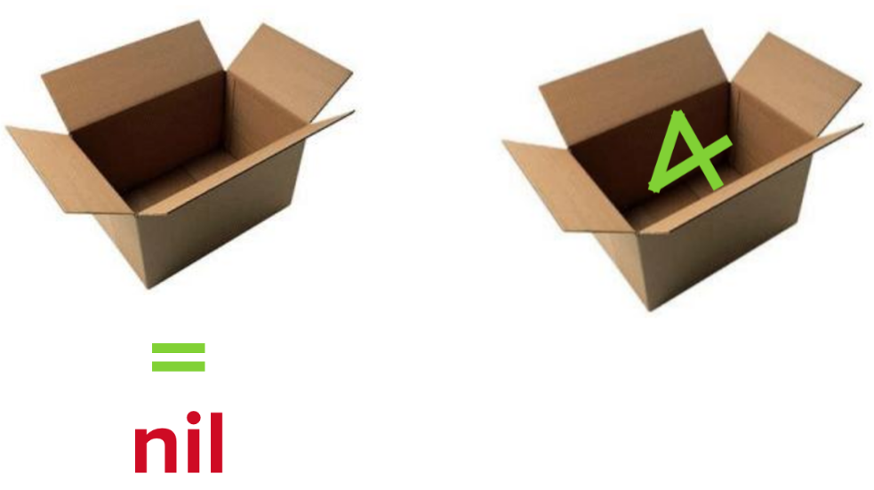

# [fit] Getting Started	  
# [fit] With _**iOS**_

--- 

# __*Bori Oludemi*__
### iOS Developer & General Technologist

--- 

### I send emails, but they're not scams
### I am not a Prince

--- 

# __*Austin Lamon*__
### iOS & Cocoa Engineer

--- 

---

# [fit] Yeah, I don't care...
## Tell me more about _**iOS**_...

---

# _**Barriers to Entry**_
- Mac (Yosemite or later)
- Swift (now up to 2.2)
- Xcode (now up to 7.3.1)
- iOS frameworks (e.g. UIKit)
- $99/year to run your app on a device/submit to App Store

---

--- 

## [fit] Just Kidding... It's Getting Better!
- $99 is now _only_ required for App Store submission
- The Equalizer -- the _**Swift**_ transition
	- Released at WWDC June, 2014 (watchOS, tvOS)
	- Simpler, more concise, safer, AND more fun!

---

---

# Let There Be Demos

---

## [fit] _**Optionals**_

---

## [fit] " They don't want us to Demo, so we're going to Demo "

## -- DJ Khaled

--- 

## [fit] _**MVC**_
- _Model:_ encapsulate the data specific to an app
- _ViewControllers:_ contain the “glue” code between views and models
- _Views:_ are parts of the app that users can see

---

---

## [fit] _**Storyboards**_
- Visually lay out your app’s scenes and the user’s path
- Scene == View == Screen
	- Has subviews (buttons, labels, text, etc)
- Tied to an instance of a _UIViewController_

---

### Cool, So you have a foundation...
### Let's pair up, and build something!

---

### Xcode New Project :flushed: 

---

### Plan
- What is Xcode?
- Basic Storyboarding + Constraints
- Animations... because :information_desk_person: 

---

---

### GITHUB URL!

---

---

# [fit] Next Steps?
- Backend integration
- watchOS?
- tvOS?
- _**Keep Learning -- Build Anything**_

---

___

# [fit] _**Resources**_
- Ray Wenderlich Tutorials (raywenderlich.com)
- Stanford iOS Class (itunes.apple.com/us/course/developing-ios-8-apps-swift/id961180099)
- developer.apple.com

---

# [fit] iOS Help?
## [fit] _**@austin\_lamon**_
## [fit] _**@borikanes**_

---

